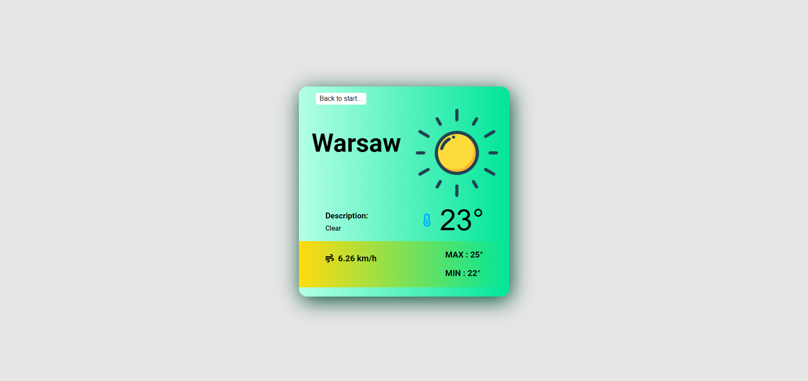

## Table of contents
* [General info](#weather-app)
* [Technologies](#technologies)
* [Setup](#setup)
* [Screenshots](#screenshoots)

## Weather app
Simple and handy webapp to check current weather.

## Technologies

Weather API from [Here!](https://openweathermap.org/)

## Setup
```
git clone https://github.com/CoderMike1/weather-app.git
```
```
cd weatherApp
```
Put API Key from [Here!](https://openweathermap.org/) to src/key.json

```
npm install
```
```
npm run build
```
```
npm run dev
```

## Screenshoots
<p align="center">
  
  
  
  
</p>

